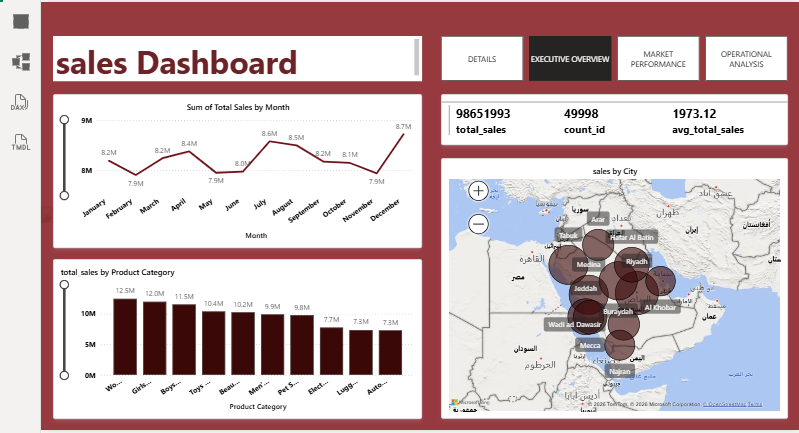
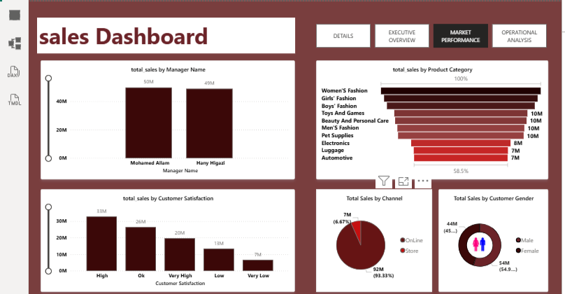

# -Saudi-Arabia-Sales
A simple sales dashboard built to analyze sales performance. It shows total sales, average sales, monthly trends, product category performance, and sales distribution by city. The dashboard helps identify key insights and supports data-driven business decisions.  Tools: Power BI, Data Analysis, Data Visualizat

### استعراض لوحات البيانات (Dashboards)

